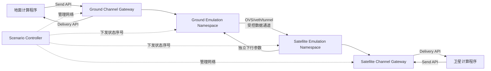

# 星地信道双生模拟软件方案

> 状态：需求与技术方案草案 v0.1  
> 日期：2026-09-03  
> 当前范围：信道 testbed；暂不包含 EASOS、模型推理策略和能量调度

## 1. 需求目标重述

老师希望建设一个尽可能接近真实星地通信行为、可重复且可扩展的 testbed。为了降低首期复杂度，系统必须把**计算**和**传输**明确分开：

1. 地面端和卫星端只负责计算，产生图像、文本、中间表示或推理结果。
2. 两端均不得把“函数调用返回”直接当成数据已经到达对端；计算结果必须提交给本端的信道软件。
3. 信道软件由一对相互对应的实例组成：`Ground Channel Twin` 与 `Satellite Channel Twin`。
4. 本端实例通过真实 Linux 网络协议栈把数据发送给远端实例；远端完成接收和校验后，才向远端计算程序交付结果。
5. 上行和下行分别具有带宽、传播/排队时延、抖动、丢包、突发丢包、乱序、链路中断和恢复等状态。
6. 信道状态由固定配置、实测 trace 或轨道/链路模型驱动，并能按相同种子和相同时间轴复现实验。
7. 软件应独立于 SpaceVerse、EASOS 和具体模型，通过稳定接口服务任意 Linux 应用；至少支持 Linux/amd64 和 Linux/arm64。
8. 实现思路参考 SpaceVerse：用 Open vSwitch（OVS）组织逻辑拓扑和链路通断，用 Linux `tc/netem` 实施链路损伤。

### 1.1 首期“尽可能真实”的准确含义

第一版目标是**IP/传输层高保真仿真**，即：

- 应用使用真实 TCP/UDP/QUIC 实现；
- 数据真实经过 Linux 内核协议栈、队列和拥塞控制；
- trace 中的带宽、时延、丢包和中断真实作用到数据包；
- 最终完成时间由实际传输产生，而不是简单计算 `size/rate` 后 `sleep`；
- 实验可测量、可复现、可审计。

它暂不等价于射频、基带、调制编码或天线硬件仿真。OVS 与 `tc/netem` 不会自行产生多普勒、自由空间路径损耗、雨衰、波束切换、调制编码和帧误码；这些只能通过实测 trace 或额外的物理/MAC 模型映射为网络层参数。正式论文中应称为“trace-driven IP-layer satellite-ground channel emulation”，不能直接称为真实卫星物理信道。

### 1.2 非目标

- 暂不实现 EASOS、置信度网络、最优停止和能量预算。
- 暂不模拟完整星座的路由协议和星间链路。
- 暂不实现 DVB-S2、CCSDS 或 5G NTN 的完整 PHY/MAC。
- 暂不把 Windows 原生网络栈作为 OVS/`tc` 执行环境。
- 不以“单个平均带宽 + 固定 RTT”冒充完整真实 trace。

## 2. SpaceVerse 的做法及本项目的继承关系

[SpaceVerse 论文](../references/papers/SpaceVerse3746027.3755299.pdf) §4.1.1 描述了如下 testbed：地面端使用 8 张 RTX 3090 的服务器，卫星端使用 Jetson AGX Xavier；星地链路由 OVS 建立，`tc` 根据商业 Starlink 地面站采集的 trace 控制链路条件；Starlink 和 Planet 的真实星座/TLE 用于实时轨迹计算和链路建立，并有 3D 界面展示。论文 §4.1.4 报告的默认星到地带宽为 110.67 Mbps。论文公开版本也可见于 [arXiv](https://arxiv.org/abs/2507.05731)。

本项目继承：

- OVS 负责逻辑端口、转发和链路通断；
- `tc/netem` 负责每个方向的网络损伤；
- trace 与轨道状态驱动链路随时间变化；
- 真实应用数据经过仿真链路，而不是只计算理论传输时间。

本项目需要补强：

- 把信道模块从 SpaceVerse 模型代码中剥离为独立软件；
- 明确定义一对双生实例、双向独立参数和交付语义；
- 分离控制网络与被仿真的数据网络；
- 增加场景 schema、接口版本、日志、时间同步、失败恢复和重复性保障；
- 公开记录 trace 来源、单位、采样周期和变换过程；
- 建立对 `tc` 实际输出的标定与 fidelity 验证。

论文中的商业 Starlink trace 没有在论文正文中给出完整字段、采样频率和公开下载地址；本次检索也没有找到作者提供的该 trace 官方 artifact。因此，110.67 Mbps 只能作为 SpaceVerse 兼容控制点，不能用于重建其完整时变信道。若要严格复现，需要向论文作者申请 trace 与控制脚本；否则使用公开数据构建“Starlink-like”场景并明确数据差异。

## 3. 技术依据与相关工作

### 3.1 OVS、Linux 网络栈与仿真可信度

| 资料 | 关键结论 | 对本项目的用途 |
|---|---|---|
| [The Design and Implementation of Open vSwitch, NSDI 2015](https://www.usenix.org/conference/nsdi15/technical-sessions/presentation/pfaff) | OVS 是面向虚拟化环境的多层可编程虚拟交换机，具有流分类、缓存和可编程转发能力 | 建立虚拟端口、数据隧道、流表、链路通断和统计 |
| [OVS 官方概览](https://docs.openvswitch.org/en/stable/intro/what-is-ovs/) | `ovs-vswitchd` 实现交换，OVSDB 保存配置；支持 OpenFlow、QoS、统计和多种隧道 | 运行时通过 OVSDB/命令控制拓扑，不自行修改业务程序 |
| [Linux tc 手册](https://man7.org/linux/man-pages/man8/tc.8.html) | `tc` 配置内核 Traffic Control，涵盖 shaping、scheduling 和 policing | 对仿真数据接口实施带宽和队列控制 |
| [tc-netem 手册](https://man7.org/linux/man-pages/man8/tc-netem.8.html) | `netem` 支持 delay、jitter、loss、state/Gilbert–Elliott、corrupt、duplicate、reorder、rate、slot 和 seed | 实现固定、随机和突发网络损伤 |
| [On the Fidelity of Single-Machine Network Emulation in Linux](https://doi.org/10.1109/MASCOTS.2015.18) | Linux 单机仿真若配置不当会产生错误结果，必须验证资源、队列和时序 | 要求每次实验同时进行 fidelity 监测，不能只相信配置值 |
| [A Network in a Laptop: Mininet](https://yuba.stanford.edu/~nickm/papers/a19-lantz.pdf) | Linux network namespace、veth 和 OVS 可让真实进程运行在虚拟网络中 | 采用 namespace/veth 隔离控制面与数据面 |
| [Mahimahi, USENIX ATC 2015](https://www.usenix.org/conference/atc15/technical-session/presentation/netravali) | trace record/replay 可让真实应用在受控网络下运行，但 trace 与工作负载语义必须匹配 | 设计 trace 回放器，并保留 trace 的采集方法和工作负载元数据 |

OVS 官方文档说明其 Linux 限速底层也依赖 Traffic Control，而且 policing 会直接丢弃超额包，不会像 shaping 一样排队；因此本项目不使用 OVS ingress policing 代替卫星链路带宽队列，而在受控 egress 端明确使用 `tc` shaping。[OVS QoS 文档](https://docs.openvswitch.org/en/latest/howto/qos/)

### 3.2 卫星网络模拟与仿真平台

| 平台 | 能力 | 本项目结论 |
|---|---|---|
| [Hypatia](https://github.com/snkas/hypatia) | 用轨道状态生成器与 ns-3 进行 LEO 包级仿真，论文复现实验公开 | 可用于生成星座拓扑、路径和理论传播时延；不直接替代双生传输网关 |
| [OpenSAND](https://github.com/CNES/opensand) | CNES 推动的 DVB-S2/DVB-RCS2 卫星通信仿真器，可连接真实应用和设备 | 若后续需要卫星 MAC/封装/调制编码层，应评估作为高保真后端；首期过重 |
| [EMANE](https://emane.io/introduction) | 分布式无线仿真框架，支持传播、天线、干扰和位置事件 | 若研究目标升级到 PHY/MAC 与干扰，可作为 `tc` 后端的替代插件 |
| [ns-3 Emulation/TapBridge](https://www.nsnam.org/docs/models/html/emulation-overview.html) | 允许真实 Linux 主机通过 TAP/FdNetDevice 进入模拟网络 | 可用于需要复杂包级模型的离线/半实物扩展，不作为 v1 依赖 |

### 3.3 轨道与传播模型资料

- [CelesTrak GP 数据接口](https://www.celestrak.org/NORAD/documentation/gp-data-formats.php) 提供 TLE/2LE 以及 CCSDS OMM 的 JSON、CSV、XML 等格式，可按卫星编号、发射批次或星座分组获取。
- [Starlink Autonomous Driving artifact](https://github.com/self-driving-satellite-network/starlink-autonomous-driving) 公布了来自 Space-Track 的大规模历史 Starlink TLE 及相关分析，可用于历史轨道场景，但它不是吞吐/丢包 trace。
- [Hypatia](https://github.com/snkas/hypatia) 可从轨道和地面站位置生成动态拓扑及传播时延。
- [ITU-R P.618-14](https://www.itu.int/rec/R-REC-P.618-14-202308-I) 是地空通信传播效应预测建议，可用于后续雨衰等物理模型。
- [3GPP TR 38.811](https://portal.3gpp.org/desktopmodules/Specifications/SpecificationDetails.aspx?specificationId=3234) 给出 NR 非地面网络研究与信道模型背景；只有在目标明确为 5G NTN 时才应采用。
- [CCSDS 有效标准列表](https://ccsds.org/publications/allpubs/) 可用于后续空间数据链路、DVB-S2 封装和高码率遥测扩展。

## 4. 推荐总体架构

### 4.1 双生节点



双生实例代码完全相同，通过配置确定 `role=ground|satellite`。每个实例包括：

1. **Channel Gateway**：面向计算程序的非特权服务，接收/发送数据、落盘缓冲、校验哈希、维护传输状态。
2. **Channel Agent**：具有最小 `CAP_NET_ADMIN` 权限的本机代理，只允许通过 Unix socket 接收已校验的网络配置操作。
3. **Emulation Namespace**：放置 veth/TAP、OVS 端口、数据地址、qdisc 和数据传输连接，避免污染宿主默认网络。
4. **Trace Player**：按单调时钟读取场景 trace，把每个状态转换为幂等的 OVS/`tc` 更新。
5. **Telemetry Collector**：读取 `tc -s`、OVS 端口统计和应用传输事件，生成统一日志。

### 4.2 控制面与数据面必须分离

至少划分两个逻辑网络：

- **管理/控制面**：SSH、健康检查、场景下发、时间同步和日志；始终可达，不施加卫星信道损伤。
- **仿真数据面**：只承载计算结果；所有包经过 OVS 和 `tc`。

即使只有一块物理网卡，也应通过 network namespace + veth + VXLAN/GRE/WireGuard 数据隧道或独立端口区分两者。禁止直接在 Orin 的默认 `eth0` 根 qdisc 上执行 `loss 100%`，否则链路中断实验会同时切断 SSH 和控制器。

正式 testbed 最佳拓扑是给数据面使用独立网卡或独立 Linux 信道机。如果 `tc/OVS` 与卫星计算同时运行在 Orin 上，必须测量仿真器 CPU/内存开销，因为它可能影响模型时延和未来能耗测量。

### 4.3 上下行只整形一次

Linux shaping 主要作用于 egress。双生系统按方向分配职责：

- `ground → satellite`：仅 Ground Twin 的仿真 egress 应用上行 profile；
- `satellite → ground`：仅 Satellite Twin 的仿真 egress 应用下行 profile。

远端不再重复添加同一个方向的时延或丢包。若 trace 给出 RTT 而非单向时延，必须在场景编译阶段显式记录拆分方法；不能默认两个方向各施加完整 RTT。

### 4.4 OVS 与 tc 的职责

```text
场景/轨道状态
    ├── 可见性、端口、路径、切换 ──> OVS
    └── rate、delay、jitter、loss、queue ──> tc/netem + HTB/TBF
```

- OVS：逻辑端口、veth/隧道接入、流表、允许/丢弃、未来多卫星路径切换、计数器。
- `tc`：带宽 shaping、排队、时延、抖动、随机/突发丢包、重复、乱序和损坏。
- `Outage`：优先用 OVS 原子流表切换到 drop，并明确清空还是保留网关队列；不通过破坏管理网卡实现。
- 每次状态更新后读取实际 OVS/qdisc 状态并记录，不能只记录“控制器希望设置什么”。

两节点 v1 实际上只靠 network namespace、veth 和 `tc` 就能工作；保留 OVS 是为了与 SpaceVerse 方法一致、提供可靠的通断和未来拓扑扩展。实现时应允许 `backend=tc-only|ovs-tc`，以便用简单后端做对照实验。

## 5. 软件分层与实现语言

### 5.1 推荐技术栈

| 层 | 推荐实现 | 原因 |
|---|---|---|
| Gateway 数据面 | Go | 并发流式传输、跨 Linux/amd64 与 arm64 编译、部署为单个 ELF、内存占用可控 |
| 特权 Agent | Go + netlink/受限命令后端 | 便于最小权限部署，不允许普通 API 任意执行 shell |
| 控制 API | gRPC + protobuf；提供 REST gateway | 二进制流、高效、契约明确，同时方便 Python/Java/C++ 客户端 |
| 场景编译器 | Python | 便于处理 CSV/Parquet、TLE、统计拟合和绘图 |
| OVS 控制 | 首版 `ovs-vsctl/ovs-ofctl` 受限封装；稳定后 OVSDB | 首版易调试，后续用事务和状态监控提高可靠性 |
| tc 控制 | netlink 优先；CLI 作为可审计 fallback | 避免字符串拼 shell，获得结构化错误和状态 |
| 服务托管 | systemd | 启动顺序、能力限制、失败重启和统一日志 |

这里的“单个 ELF”不是把 OVS、内核模块和模型打包到一个文件；它只表示双生应用自身易于分发。目标机仍需安装兼容的 `iproute2`、Open vSwitch 和对应内核功能。

### 5.2 建议目录

```text
channel_twin/
├── api/
│   ├── channel.proto
│   └── openapi.yaml
├── cmd/
│   ├── channel-gateway/
│   └── channel-agent/
├── internal/
│   ├── transfer/
│   ├── spool/
│   ├── netlink/
│   ├── ovs/
│   ├── clock/
│   └── telemetry/
├── controller/
│   ├── scenario_controller.py
│   ├── trace_compiler.py
│   ├── orbit_compiler.py
│   └── validators.py
├── schemas/
│   ├── scenario.schema.json
│   ├── channel-state.schema.json
│   └── event.schema.json
├── scenarios/
│   ├── static/
│   ├── empirical/
│   └── orbital/
├── deployment/
│   ├── systemd/
│   └── scripts/
├── tests/
│   ├── unit/
│   ├── namespace/
│   ├── cross_host/
│   └── fidelity/
└── docs/
```

该目录与 `ground/`、`satellite/` 计算服务平级，不能放进 EASOS 包内。

## 6. 对计算程序暴露的接口

### 6.1 数据面 API

建议主接口使用 gRPC streaming：

```protobuf
service ChannelGateway {
  rpc Send(stream TransferChunk) returns (TransferReceipt);
  rpc GetTransfer(TransferId) returns (TransferStatus);
  rpc SubscribeDeliveries(DeliverySubscription) returns (stream DeliveryEvent);
  rpc Receive(TransferId) returns (stream TransferChunk);
}
```

传输元数据至少包含：

```text
protocol_version
run_id
transfer_id
idempotency_key
source_node / destination_node
direction: UPLINK | DOWNLINK
artifact_type: IMAGE | TEXT | MODEL_RESULT | TENSOR | OTHER
content_type
payload_bytes
sha256
created_monotonic_ns
deadline_monotonic_ns (optional)
transport_profile: tcp | udp | quic
delivery_policy: FAIL_FAST | QUEUE_UNTIL_CONTACT | EXPIRE_AT_DEADLINE
```

关键语义：

- `Send` 返回 `ACCEPTED` 只表示本端持久化/接管数据，不表示已到达对端。
- 只有远端收到全部字节并验证 SHA-256 后，状态才变为 `DELIVERED`。
- 计算程序通过订阅、轮询或本地 callback 获得交付事件。
- `transfer_id` 幂等，重试不能生成两份远端结果。
- 传输中断时保留已发送字节、重传字节、排队时间和失败原因。
- 正式测量路径必须发送真实字节；只根据大小计算完成时间的 fast/mock 模式只能用于单元测试。

### 6.2 控制面 API

```text
POST /v1/scenarios/validate
POST /v1/scenarios/load
POST /v1/runs
POST /v1/runs/{run_id}/prepare
POST /v1/runs/{run_id}/start
POST /v1/runs/{run_id}/pause
POST /v1/runs/{run_id}/stop
GET  /v1/runs/{run_id}/state
GET  /v1/runs/{run_id}/metrics
GET  /v1/system/capabilities
GET  /health
```

场景启动采用 barrier：控制器先向两个 Agent 下发 `PREPARE(run_id, scenario_hash, T0)`；两端校验 trace、时钟和内核能力后返回 READY；控制器再发 COMMIT。任一端未准备好则整次运行失败，不能让一端单独开始。

### 6.3 状态更新与幂等

每个方向的状态携带严格递增的 `state_seq`、生效单调时间 `effective_at_ns` 和完整状态快照。Agent 只接受更大的序号；重复序号必须返回相同结果；丢序时请求控制器重发完整快照，不基于未知旧状态打补丁。

## 7. 统一场景与 trace 格式

### 7.1 场景元数据

```yaml
schema_version: "1.0"
scenario_id: wetlinks-replay-001
source_type: empirical_trace
source_uri: "..."
source_license: "CC BY-SA 4.0"
source_sha256: "..."
time_mode: realtime
time_scale: 1.0
random_seed: 20260903
start_offset_ms: 0
tick_ms: 1000
ground_node: ground-01
satellite_node: satellite-01
clock_requirement_ms: 1.0
```

### 7.2 每方向链路状态

| 字段 | 单位/类型 | 说明 |
|---|---|---|
| `timestamp_ns` | int64 | 相对场景起点的单调时间 |
| `duration_ns` | int64 | 本状态有效时间 |
| `state_seq` | int64 | 严格递增序号 |
| `src`、`dst` | string | 有向链路端点 |
| `visible` | bool | 几何或场景可用性 |
| `rate_bps` | bit/s | 链路容量；不能混用应用 goodput |
| `one_way_delay_ms` | ms | 本方向施加的时延 |
| `jitter_ms` | ms | 同时记录采用的分布 |
| `loss_model` | random/state/gemodel/trace | 丢包模型 |
| `loss_params` | object | 概率、转移概率或 trace 索引 |
| `duplicate_pct` | % | 包复制 |
| `corrupt_pct` | % | 包损坏 |
| `reorder_pct` | % | 包乱序 |
| `queue_limit_bytes` | bytes | 仿真瓶颈队列上限 |
| `mtu_bytes` | bytes | 防止隐式分片差异 |
| `outage_policy` | enum | drop、queue 或 fail |
| `provenance` | object | 原始列、变换公式、假设和置信度 |

上行、下行分别存储。不可用字段必须为 `null` 并说明原因，不能用 0 混淆“真实为零”和“没有数据”。

### 7.3 trace 语义陷阱

- 实测 TCP/iperf goodput 不是链路容量；直接拿 goodput 当 `rate` 会把原工作负载和拥塞控制特性带入新实验。
- ICMP RTT 包含终端、卫星、网关、PoP、地面互联网和目标服务器，通常不是纯星地传播时延。
- `RTT/2` 只有在上下行和地面路径近似对称时才是单向时延估计，必须标注假设。
- ping 丢包、UDP 丢包、TCP 重传和业务失败率不是同一个指标。
- 低频 speed test 无法恢复亚秒级切换和突发丢包。
- 轨道 TLE 与网络 trace 若不是同一时间、地点和终端采集，不得强行按卫星位置对齐。

## 8. 已找到的公开数据

### 8.1 推荐优先级

| 优先级 | 数据 | 包含内容 | 用途与限制 |
|---|---|---|---|
| A | [WetLinks](https://github.com/sys-uos/WetLinks) | 约 14 万次测量；上下行吞吐、RTT、丢包、traceroute、终端元数据及相邻气象站数据；两处欧洲站点、约半年 | 适合提取长期分布、相关性和天气条件；约 3 分钟级采样不能复现快速切换；许可 CC BY-SA 4.0 |
| A | [LENS](https://github.com/clarkzjw/LENS) | 多个 Starlink dish、多个 PoP 和地区的 IRTT/ping 长期数据，另有 OneWeb 数据 | 适合单包 RTT、丢包和 outage burst；规模很大，应先取 processed 小样本；数据许可与代码许可分别核对 |
| A | [Starlink Latency and Downlink Throughput Dataset](https://zenodo.org/records/10020034) | IRTT 与 iperf3，公开 README/脚本，完整数据约 470 GB | 适合精细时延和下行吞吐标定；体积过大，先下载 README 和 1.2 GB 样例而不是全量 |
| B | [Satellite-vs-Cellular CoNEXT'23 artifact](https://github.com/Starlink-Project/Satellite-vs-Cellular) | 不同区域和遮挡条件下 Starlink/蜂窝吞吐、RTT、TCP 丢包等 | 适合构造城市/农村/遮挡场景；需核对各文件采样周期和方向 |
| B | [Starlink Autonomous Driving artifact](https://github.com/self-driving-satellite-network/starlink-autonomous-driving) | 2019–2022 的大规模 Starlink TLE、交会及论文图表数据 | 适合历史轨道和拓扑，不含用户链路吞吐 trace |
| B | [CelesTrak 当前 GP/OMM](https://www.celestrak.org/NORAD/documentation/gp-data-formats.php) | 当前 TLE/OMM，多种机器可读格式 | 适合新轨道场景；下载时保存原文件、时间和哈希，不能运行时静默更新 |
| B | [Hypatia](https://github.com/snkas/hypatia) | 星座生成、动态状态和 ns-3 LEO 仿真代码 | 适合产生几何可见性、路径和传播时延的合成 trace |

[WetLinks 论文](https://dl.ifip.org/db/conf/tma/tma2024/tma2024-final10.pdf)说明其原始数据分别保存 iperf、ping、traceroute、Starlink 元数据和气象数据；这比只使用平均带宽更适合作为 v1 数据源。[LENS 论文引用和数据说明](https://github.com/clarkzjw/LENS)显示其数据覆盖多个 dish 与 PoP。两者仍主要反映商用 Starlink 互联网服务，而不是遥感卫星直接到任务地面站的纯链路。

### 8.2 推荐 v1 数据组合

1. **SpaceVerse-compatible-static**：110.67 Mbps + 明确固定 RTT/0 丢包，仅用于与论文默认参数兼容。
2. **Empirical-Starlink**：从 WetLinks 提取低/中/高分位吞吐和 RTT，从 LENS 提取短时延/丢包/中断序列；不拼成“原始实测”，而标为由两个来源构造的 composite scenario。
3. **Orbit-window**：CelesTrak/Hypatia 生成可见窗口和传播时延，吞吐/丢包先采用独立经验条件分布。
4. **Stress profiles**：人为设置低带宽、长 RTT、突发丢包和中断，用于软件边界测试，不声称来自真实 Starlink。

公开数据在正式采用前必须保存：原始下载 URL、版本/commit、下载日期、许可证、SHA-256、原始 README、选择的列、过滤规则、重采样规则和生成脚本。

## 9. 仍然需要的数据和决策

### 9.1 开发前必须由课题组明确

| 问题 | 为什么必须明确 | 建议默认值 |
|---|---|---|
| 模拟对象是 Starlink 用户的商用互联网，还是遥感卫星直连地面站 | 二者拓扑、协议、频段、链路预算和地面路径完全不同 | v1 称为“Starlink-like IP link”；后续再定义遥感链路 |
| 仿真层级 | 决定只用 OVS/tc，还是需要 OpenSAND/EMANE | v1 IP/传输层；不模拟 PHY/MAC |
| 实时时间还是加速时间 | 真实 TCP testbed 很难在任意倍速下保持相同动力学 | 正式实验 1× 实时；fast mode 仅测试 |
| 中断时数据排队还是立即失败 | 会显著改变传输完成时间和业务成功率 | 三种策略都支持，每个实验显式选择 |
| 主要传输协议 | TCP、QUIC、UDP 对 loss/RTT 的响应不同 | v1 TCP；后续加入 QUIC/UDP |
| 是否需要并发多流 | 单流 trace 不能直接代表多任务竞争 | v1 支持配置 1/2/4 并发流 |
| 部署拓扑 | Windows 无法原生运行 Linux OVS/tc | 正式实验增加 Linux 信道机或 Linux VM；不推荐 WSL 隐式 NAT |

### 9.2 建立轨道驱动模型需要

- 卫星 NORAD ID/TLE/OMM 及其 epoch；
- 地面站经纬度、海拔和最低仰角；
- 仿真日期、时区、轨道传播步长；
- 使用 SGP4 的具体实现和版本；
- 可见窗口、斜距、仰角、切换规则；
- 若有星间链路：邻接规则、最大距离、端口/波束数量和路由策略。

### 9.3 从轨道几何推导网络质量还需要

- 上下行频段、信道带宽；
- 卫星和地面发射功率、天线增益/方向图、馈线损耗；
- 接收机噪声温度或 G/T、实现损耗；
- 调制编码方案、码率、SNR/EsN0 到吞吐/PER 的映射；
- 大气气体、雨衰、云雾和闪烁模型；
- 波束调度、用户竞争和切换开销；
- 链路层 ARQ/FEC、帧大小和重传规则。

没有这些数据时，可以从轨道得到传播时延和几何可见性，但不能严谨地从仰角直接得到 Mbps 或丢包率。

### 9.4 应用与传输数据需要

- 每类计算结果的真实字节大小分布，而不只是平均值；
- 上行/下行比例、到达过程和并发度；
- deadline、超时、重试、断点续传和幂等语义；
- TCP/QUIC 版本、拥塞控制算法、socket buffer、MTU；
- 是否压缩、分块大小、序列化格式和校验开销；
- 地面/卫星本地落盘和交付时间是否计入通信时延。

### 9.5 实测 trace 必须具备的元数据

- UTC 时间戳、采样间隔和连续时长；
- 测量地理位置、终端型号/固件、服务套餐、PoP；
- 测量方向、协议、服务器位置和路径；
- 原始包级或至少秒级 throughput/RTT/loss/outage；
- 天气、遮挡、终端状态和是否发生切换；
- 缺失值与 `-1/0` 的确切含义；
- 测量工具版本、命令、包长和负载强度。

## 10. trace 到 tc/OVS 的转换

### 10.1 编译流程

```text
原始公开数据/TLE
  → 完整性与许可证检查
  → 单位统一、异常值标记、缺失值处理
  → 区分 uplink/downlink、RTT/one-way、capacity/goodput
  → 按目标 tick 重采样
  → 拟合随机/突发丢包与状态驻留时间
  → 生成 canonical directed-link trace
  → schema 校验 + hash
  → dry-run 输出 tc/OVS 变更计划
  → 两端 barrier 同步回放
```

### 10.2 参数映射

| 标准 trace | Linux 实现 |
|---|---|
| `rate_bps` | HTB/TBF shaping 或验证后的 `netem rate` |
| `one_way_delay_ms`、`jitter` | `netem delay` + 显式分布 |
| 独立 loss | `netem loss random` |
| Markov/burst loss | `netem loss state` 或 `gemodel` |
| duplicate/corrupt/reorder | 对应 `netem` 参数 |
| queue bytes | qdisc packet limit 按 MTU 转换，或使用 byte-aware qdisc |
| visibility/outage | OVS drop flow/端口状态 |
| multi-path/handover | OVS 流表事务切换 |

qdisc 组合顺序会改变结果。例如 policing 丢包与 shaping 排队对 TCP 的影响完全不同；必须把生成后的 `tc -s -d qdisc show` 保存到每次运行的 manifest。

## 11. 时间同步和动态更新

- 两端使用 `CLOCK_MONOTONIC_RAW` 或等价单调时钟驱动状态，UTC 只用于跨日志关联。
- 分布式节点通过 chrony/NTP；若要求亚毫秒事件对齐并有硬件条件，使用 PTP。
- 运行前记录两端时钟偏差；超过场景阈值则拒绝启动。
- 状态更新提前发送，在 `effective_at_ns` 本地生效，避免控制 API 网络时延直接变成场景抖动。
- 记录计划生效时间、实际应用时间和差值；连续超限则标记本次运行不可信。
- trace tick 不应盲目设得很小：频繁重建 qdisc 可能造成额外抖动或队列重置。先测量本机更新时间，再确定 100 ms、1 s 或更粗粒度。

## 12. 标定、验证与真实性判定

### 12.1 静态 profile 验证

每个固定 profile 至少测试：

- `ping/fping`：RTT 分布和丢包；
- `iperf3 TCP`：单流/多流 goodput；
- `iperf3 UDP`：目标速率下的 loss、jitter 和乱序；
- 固定大小传输：1 KB、1 MB、10 MB、100 MB 的完成时间；
- `tc -s` 与 OVS 端口计数器：入队、丢包、overlimit、backlog；
- CPU、内存、软中断、上下文切换：确认仿真器自身不是意外瓶颈。

### 12.2 动态 trace 验证

比较目标 trace 与实测输出：

- rate、RTT、jitter、loss 的 P50/P90/P95/P99；
- 时间序列相关性、自相关和状态驻留时间；
- 连续丢包长度与 outage duration；
- profile 切换响应时间和超调；
- 不同大小、协议和并发度下的传输完成时间；
- 相同 seed 重复运行的分布差异。

初始工程门槛建议：稳定 profile 的 UDP 速率误差不超过目标的 5%，中位附加时延误差不超过 `max(2 ms, 目标的 5%)`，配置为 0 丢包时不出现仿真器导致的持续丢包；动态场景的各项门槛在预实验后冻结。所有门槛都应包含机器负载范围，不能只在空闲主机上验证。

### 12.3 端到端验收

- 任一计算结果只有在远端校验成功后才显示 `DELIVERED`。
- 上下行同一 profile 不会被重复施加。
- `Outage` 不影响 SSH、控制 API 和时间同步。
- 两端场景 hash、run_id、state_seq 和生效时间一致。
- 相同 trace/seed/软件版本可复现统计结果。
- trace 丢列、单位错误、时间倒退和非法概率会在启动前失败。
- Agent 崩溃后清理/恢复 qdisc 和 OVS 状态，不遗留影响下一次实验的规则。
- Linux/amd64 与 Linux/arm64 均通过相同 API contract tests。
- 生成一份包含软件版本、内核、iproute2、OVS、qdisc、trace hash 和时钟偏差的运行 manifest。

## 13. 部署建议

### 13.1 推荐硬件拓扑

优先级从高到低：

1. **独立双网口 Linux 信道机**：计算节点与仿真器分离，管理网和数据网分离，最适合正式实验。
2. **地面 Linux VM + Orin namespace**：适合现有 Windows PC，但要验证 VM 调度和虚拟交换开销。
3. **两端直接运行 twin**：部署最少，但 Orin 上的仿真开销会与计算竞争。
4. **WSL/Docker Desktop 隐式网络**：只适合开发 API，不建议作为正式 fidelity 结果。

如果只能使用当前 Windows PC + Orin NX，建议让地面计算仍在 Windows，Ground Twin 运行在具有明确桥接网卡的 Ubuntu VM 中；Windows 通过未受损的本地/管理 API 提交结果，VM 与 Orin 的数据隧道才进入受控信道。

### 13.2 Linux 依赖与权限

- 基线系统：先以 Ubuntu 22.04 LTS 验证，随后根据 Orin JetPack 实际内核建立兼容矩阵。
- 依赖：`iproute2`、`openvswitch-switch`、`iperf3`、`fping`、`tcpdump`、chrony；可选 PTP、Wireshark、Parquet 工具。
- Gateway 使用普通用户运行。
- Agent 仅获得 `CAP_NET_ADMIN`，通过 Unix socket 和白名单 schema 接受操作；不向网络暴露任意 shell 接口。
- 发布 linux/amd64、linux/arm64 两套签名二进制、配置 schema、systemd unit 和检查脚本。
- 安装程序必须支持 `doctor`、`dry-run`、`reset-network` 和卸载恢复。

## 14. 实施阶段

| 阶段 | 内容 | 交付物 | 退出条件 |
|---|---|---|---|
| S0 需求/数据冻结 | 明确仿真对象、层级、协议、部署拓扑和 trace 来源 | 本文 v1.0、数据卡、决策记录 | 阻塞决策全部确认 |
| S1 Twin API | 两端 Gateway、流式发送、落盘、哈希、状态与幂等 | amd64/arm64 二进制、proto、单元测试 | 无损普通 LAN 双向传输通过 |
| S2 tc 静态信道 | namespace/veth、特权 Agent、rate/delay/loss/outage | 静态 profiles、doctor/reset | 静态 fidelity 门槛通过 |
| S3 OVS + 动态 trace | OVS 数据路径、场景控制器、barrier、状态序号 | trace player、运行 manifest | 动态 trace 可重复回放 |
| S4 公开数据场景 | WetLinks/LENS/SpaceVerse-compatible 编译器 | 数据卡、场景集、生成脚本 | 来源与变换完全可审计 |
| S5 轨道场景 | TLE/OMM、SGP4、地面站、窗口和传播时延 | orbit-window trace | 可见性和时延与参考工具一致 |
| S6 端到端评测 | 接入任意计算 mock 与真实模型输出 | 报告、图表、故障注入结果 | 跨架构与真实性验收通过 |
| S7 可选 PHY/MAC | 评估 OpenSAND/EMANE/3GPP NTN 后端 | 插件 PoC | 仅在研究问题需要时启动 |

建议先完成 S0–S3，再接入任何模型。S1–S3 预计 3–5 周，数据清洗和 fidelity 验证约 2–3 周；时间取决于是否有独立 Linux 信道机和真实 Starlink trace。

## 15. 主要风险与规避

| 风险 | 后果 | 规避 |
|---|---|---|
| 把端到端 Starlink RTT 当纯星地时延 | 结论物理含义错误 | 保存路径和测量服务器元数据，场景命名为 E2E service channel |
| 两端都施加 RTT/loss | 时延和丢包被重复计算 | 按有向 egress 分工，运行时检查 qdisc 所属方向 |
| 在管理网卡上制造 outage | SSH/控制器断开 | 独立数据 namespace/隧道/网卡 |
| policing 代替 shaping | TCP 因额外丢包而非带宽队列降速 | 使用 HTB/TBF shaping，记录队列和 backlog |
| trace 采样过粗 | 无法复现快速 handover/outage | 选择包级/秒级 LENS 数据；低频数据只用于慢变化场景 |
| 仿真器 CPU 饱和 | 测得的是主机瓶颈 | 记录软中断/CPU，限制场景速率并进行 capacity calibration |
| 动态更新重置队列 | 产生非预期突变 | 测试 replace/change 行为，尽量原子更新并记录队列状态 |
| VM/WSL 隐式 NAT 和缓冲 | 隐藏或叠加时延 | 正式实验使用桥接 Linux VM 或独立信道机 |
| 随机过程不可复现 | 方法比较不公平 | 固定 trace 和 seed，记录内核/iproute2 版本 |
| 代理先完整缓存再发送 | 小/大消息语义失真 | 同时支持 streaming 与 spool，明确首字节和完整交付时间 |

## 16. 当前建议结论

1. 将新软件定义为独立的 **Satellite–Ground Channel Twin**，暂时冻结 EASOS。
2. v1 使用真实 Linux 数据路径，采用 `network namespace + veth + OVS + tc/netem`。
3. 两端计算程序只调用 Gateway API；远端校验完成才视为传输成功。
4. 控制面永不受损，数据面才施加星地信道条件。
5. 上行在 Ground Twin egress 整形，下行在 Satellite Twin egress 整形，禁止重复损伤。
6. 运行面推荐 Go，场景/轨道/数据处理使用 Python。
7. SpaceVerse 的 110.67 Mbps 仅作为兼容基线；真实动态场景优先使用 WetLinks、LENS 和公开 TLE/Hypatia。
8. 第一版只声称 IP/传输层高保真；若研究问题要求 PHY/MAC，再接入 OpenSAND 或 EMANE。
9. 正式实验最好增加独立 Linux 信道机；若继续使用 Windows 地面 PC，则 Ground Twin 放在桥接 Ubuntu VM。
10. 下一步不是写 `tc` 命令，而是完成 S0：确认第 9 节的阻塞决策并冻结 canonical trace schema。

## 17. 参考资料

1. Y. Zhang et al., *A Satellite-Ground Synergistic Large Vision-Language Model System for Earth Observation*, ACM MM 2025 / [arXiv](https://arxiv.org/abs/2507.05731).
2. B. Pfaff et al., [*The Design and Implementation of Open vSwitch*](https://www.usenix.org/conference/nsdi15/technical-sessions/presentation/pfaff), NSDI 2015.
3. Linux iproute2, [`tc(8)`](https://man7.org/linux/man-pages/man8/tc.8.html) and [`tc-netem(8)`](https://man7.org/linux/man-pages/man8/tc-netem.8.html).
4. J. D. Beshay et al., [*On the Fidelity of Single-Machine Network Emulation in Linux*](https://doi.org/10.1109/MASCOTS.2015.18), MASCOTS 2015.
5. B. Lantz et al., [*A Network in a Laptop: Rapid Prototyping for Software-Defined Networks*](https://yuba.stanford.edu/~nickm/papers/a19-lantz.pdf), HotNets 2010.
6. R. Netravali et al., [*Mahimahi: Accurate Record-and-Replay for HTTP*](https://www.usenix.org/conference/atc15/technical-session/presentation/netravali), USENIX ATC 2015.
7. S. Kassing et al., [Hypatia repository and IMC 2020 artifact](https://github.com/snkas/hypatia).
8. D. Laniewski et al., [WetLinks dataset](https://github.com/sys-uos/WetLinks) and [TMA 2024 paper](https://dl.ifip.org/db/conf/tma/tma2024/tma2024-final10.pdf).
9. J. Zhao and J. Pan, [LENS dataset and MMSys 2024 artifact](https://github.com/clarkzjw/LENS).
10. J. Zhao and J. Pan, [Starlink Latency and Downlink Throughput Measurement Dataset](https://zenodo.org/records/10020034).
11. Starlink-Project, [Satellite-vs-Cellular CoNEXT 2023 artifact](https://github.com/Starlink-Project/Satellite-vs-Cellular).
12. Yuanjie Li et al., [Starlink Autonomous Driving MobiCom 2023 artifact](https://github.com/self-driving-satellite-network/starlink-autonomous-driving).
13. CelesTrak, [GP/TLE/OMM data formats and query interface](https://www.celestrak.org/NORAD/documentation/gp-data-formats.php).
14. CNES, [OpenSAND](https://github.com/CNES/opensand).
15. NRL/Adjacent Link, [EMANE Guide](https://emane.io/introduction).
16. ITU-R, [Recommendation P.618-14](https://www.itu.int/rec/R-REC-P.618-14-202308-I).
17. 3GPP, [TR 38.811: Study on NR to support non-terrestrial networks](https://portal.3gpp.org/desktopmodules/Specifications/SpecificationDetails.aspx?specificationId=3234).
18. CCSDS, [Active Publications](https://ccsds.org/publications/allpubs/).

