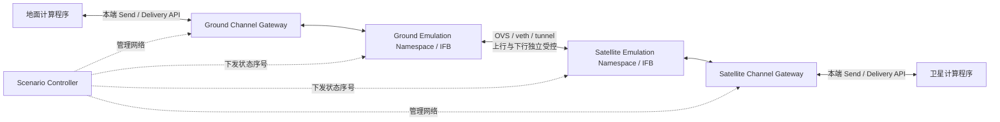

# 星地信道双生模拟软件方案

> 状态：v0.2；课题组已确认 v1 需求边界，实现与标定尚未完成  
> 日期：2026-09-05  
> 当前范围：信道 testbed；暂不包含 EASOS、模型推理策略和能量调度

## 本次确认的约束

| 决策 | v1 固定要求 |
|---|---|
| 模拟对象 | 遥感卫星直连任务地面站，包含地面上行与卫星下行；不是 Starlink 商用互联网接入 |
| 仿真层级 | IP/传输层网络仿真；不实现卫星 PHY/MAC |
| 时间 | 1× 实时时间，真实 TCP 协议栈；不加速轨道窗口或 TCP 计时器 |
| 中断语义 | 已接收的样本持久化排队，恢复后重试；链路中断不使任务终止失败 |
| 并发 | 暂不研究并发；首版按全系统同一时刻一个业务样本在传实现 |
| 传输协议 | 双生网关之间使用 TCP |
| 拓扑 | 使用 Open vSwitch（OVS）显式构建拓扑；第一阶段仅一颗卫星、一个地面站、两条有向链路 |

“obs”按上下文理解为 **OVS**。本文中的软件分层/实施等级不等于 OSI 层号：**当前不是 OSI L1 物理层仿真**。使用虚拟交换机也不意味着实现了卫星专用 MAC。

工程默认值与老师确认的要求分开：串行 FIFO、连接失效后整样本重传、先落盘再发送是本方案为降低 v1 复杂度选择的实现策略，不宣称是所有遥感任务的实际策略。

## 1. 需求目标重述

老师希望建设一个尽可能接近真实星地通信行为、可重复且可扩展的 testbed。为了降低首期复杂度，系统必须把**计算**和**传输**明确分开：

1. 地面端和卫星端只负责计算，产生图像、文本、中间表示或推理结果。
2. 两端均不得把“函数调用返回”直接当成数据已经到达对端；计算结果必须提交给本端的信道软件。
3. 信道软件由一对相互对应的实例组成：`Ground Channel Twin` 与 `Satellite Channel Twin`。
4. 本端实例通过真实 Linux 网络协议栈把数据发送给远端实例；远端完成接收和校验后，才向远端计算程序交付结果。
5. 上行和下行分别具有带宽、传播/排队时延、抖动、丢包、突发丢包、乱序、链路中断和恢复等状态。
6. 信道状态由固定配置、实测 trace 或轨道/链路模型驱动，并能按相同种子和相同时间轴复现实验。
7. 软件应独立于 SpaceVerse、EASOS 和具体模型，通过稳定接口服务任意 Linux 应用；至少支持 Linux/amd64 和 Linux/arm64。
8. 实现思路参考 SpaceVerse：用 Open vSwitch（OVS）组织逻辑拓扑和链路通断，用 Linux `tc/netem` 实施链路损伤。

### 1.1 首期“尽可能真实”的准确含义

第一版目标是**可标定的 IP 层链路仿真与真实 TCP 传输**，即：

- 双生网关使用真实 TCP 实现，包含握手、ACK、拥塞控制、超时和重传；
- 数据真实经过 Linux 内核协议栈、队列和拥塞控制；
- trace 中的带宽、时延、丢包和中断真实作用到数据包；
- 最终完成时间由实际传输产生，而不是简单计算 `size/rate` 后 `sleep`；
- 实验可测量、可复现、可审计。

它不等价于射频、基带、调制编码或天线硬件仿真。OVS 与 `tc/netem` 不会自行产生多普勒、路径损耗、雨衰、调制编码和帧误码；下层影响仅通过实测或有依据的模型映射为 IP 层有效速率、时延和残余丢包。正式论文建议称为“面向遥感直连场景的实时、接触窗口驱动 IP 层星地网络仿真 testbed”。只有通过第 12 节验证后，才能针对已验证参数范围讨论保真度。

### 1.2 非目标

- 暂不实现 EASOS、置信度网络、最优停止和能量预算。
- 暂不模拟完整星座的路由协议和星间链路。
- 暂不实现多任务并发、TCP/QUIC/UDP 对比、多卫星切换、完整 DTN/BPv7 协议栈。
- 暂不实现 DVB-S2、CCSDS 或 5G NTN 的完整 PHY/MAC。
- 暂不把 Windows 原生网络栈作为 OVS/`tc` 执行环境。
- 不以“单个平均带宽 + 固定 RTT”冒充完整真实 trace。

## 2. SpaceVerse 的做法及本项目的继承关系

[SpaceVerse 论文](./references/papers/SpaceVerse3746027.3755299.pdf) §4.1.1 描述了如下 testbed：地面端使用 8 张 RTX 3090 的服务器，卫星端使用 Jetson AGX Xavier；星地链路由 OVS 建立，`tc` 根据商业 Starlink 地面站采集的 trace 控制链路条件；Starlink 和 Planet 的真实星座/TLE 用于实时轨迹计算和链路建立，并有 3D 界面展示。论文 §4.1.4 报告的默认星到地带宽为 110.67 Mbps。论文公开版本也可见于 [arXiv](https://arxiv.org/abs/2507.05731)。

本项目继承：

- OVS 负责逻辑端口、转发和链路通断；
- `tc/netem` 负责每个方向的网络损伤；
- trace 与轨道状态驱动链路随时间变化；
- 真实应用数据经过仿真链路，而不是只计算理论传输时间。

本项目需要补强：

- 把信道模块从 SpaceVerse 模型代码中剥离为独立软件；
- 明确定义一对双生实例、双向独立参数和交付语义；
- 分离控制网络与被仿真的数据网络；
- 增加场景 schema、接口版本、日志、时间同步、失败恢复和重复性保障；
- 公开记录 trace 来源、单位、采样周期和变换过程；
- 建立对 `tc` 实际输出的标定与 fidelity 验证。

现有资料未提供可直接复用的完整 SpaceVerse trace 与控制脚本，不能据默认带宽重建其时变信道，也不能据 OVS/tc 判断它使用了 TCP。若需严格复现，应另行申请原始 artifact。当前项目只继承其网络仿真实现思路，**不继承 Starlink 商用互联网作为主实验对象**；110.67 Mbps 或公开 Starlink trace 仅可作为单独标注的辅助对照/压力场景，不代表遥感直连链路。

## 3. 技术依据与相关工作

### 3.1 OVS、Linux 网络栈与仿真可信度

| 资料 | 关键结论 | 对本项目的用途 |
|---|---|---|
| [The Design and Implementation of Open vSwitch, NSDI 2015](https://www.usenix.org/conference/nsdi15/technical-sessions/presentation/pfaff) | OVS 是面向虚拟化环境的多层可编程虚拟交换机，具有流分类、缓存和可编程转发能力 | 建立虚拟端口、数据隧道、流表、链路通断和统计 |
| [OVS 官方概览](https://docs.openvswitch.org/en/stable/intro/what-is-ovs/) | `ovs-vswitchd` 实现交换，OVSDB 保存配置；支持 OpenFlow、QoS、统计和多种隧道 | 运行时通过 OVSDB/命令控制拓扑，不自行修改业务程序 |
| [Linux tc 手册](https://man7.org/linux/man-pages/man8/tc.8.html) | `tc` 配置内核 Traffic Control，涵盖 shaping、scheduling 和 policing | 对仿真数据接口实施带宽和队列控制 |
| [tc-netem 手册](https://man7.org/linux/man-pages/man8/tc-netem.8.html) | `netem` 支持 delay、jitter、loss、state/Gilbert–Elliott、corrupt、duplicate、reorder、rate、slot 和 seed | 实现固定、随机和突发网络损伤 |
| [On the Fidelity of Single-Machine Network Emulation in Linux](https://doi.org/10.1109/MASCOTS.2015.18) | Linux 单机仿真若配置不当会产生错误结果，必须验证资源、队列和时序 | 要求每次实验同时进行 fidelity 监测，不能只相信配置值 |
| [A Network in a Laptop: Mininet](https://yuba.stanford.edu/~nickm/papers/a19-lantz.pdf) | Linux network namespace、veth 和 OVS 可让真实进程运行在虚拟网络中 | 采用 namespace/veth 隔离控制面与数据面 |
| [Mahimahi, USENIX ATC 2015](https://www.usenix.org/conference/atc15/technical-session/presentation/netravali) | trace record/replay 可让真实应用在受控网络下运行，但 trace 与工作负载语义必须匹配 | 设计 trace 回放器，并保留 trace 的采集方法和工作负载元数据 |

OVS 官方文档说明其 Linux 限速底层也依赖 Traffic Control，而且 policing 会直接丢弃超额包，不会像 shaping 一样排队；因此本项目不使用 OVS ingress policing 代替卫星链路带宽队列，而在受控 egress 端明确使用 `tc` shaping。[OVS QoS 文档](https://docs.openvswitch.org/en/latest/howto/qos/)

### 3.2 卫星网络模拟与仿真平台

| 平台 | 能力 | 本项目结论 |
|---|---|---|
| [Hypatia](https://github.com/snkas/hypatia) | 用轨道状态生成器与 ns-3 进行 LEO 包级仿真，论文复现实验公开 | 可用于生成星座拓扑、路径和理论传播时延；不直接替代双生传输网关 |
| [OpenSAND](https://github.com/CNES/opensand) | CNES 推动的 DVB-S2/DVB-RCS2 卫星通信仿真器，可连接真实应用和设备 | 若后续需要卫星 MAC/封装/调制编码层，应评估作为高保真后端；首期过重 |
| [EMANE](https://emane.io/introduction) | 分布式无线仿真框架，支持传播、天线、干扰和位置事件 | 若研究目标升级到 PHY/MAC 与干扰，可作为 `tc` 后端的替代插件 |
| [ns-3 Emulation/TapBridge](https://www.nsnam.org/docs/models/html/emulation-overview.html) | 允许真实 Linux 主机通过 TAP/FdNetDevice 进入模拟网络 | 可用于需要复杂包级模型的离线/半实物扩展，不作为 v1 依赖 |

### 3.3 轨道与传播模型资料

- [CelesTrak GP 数据接口](https://www.celestrak.org/NORAD/documentation/gp-data-formats.php) 提供 TLE/2LE 以及 CCSDS OMM 的 JSON、CSV、XML 等格式，可按卫星编号、发射批次或星座分组获取。
- [Starlink Autonomous Driving artifact](https://github.com/self-driving-satellite-network/starlink-autonomous-driving) 公布了来自 Space-Track 的大规模历史 Starlink TLE 及相关分析，可用于历史轨道场景，但它不是吞吐/丢包 trace。
- [Hypatia](https://github.com/snkas/hypatia) 可从轨道和地面站位置生成动态拓扑及传播时延。
- [ITU-R P.618-14](https://www.itu.int/rec/R-REC-P.618-14-202308-I) 是地空通信传播效应预测建议，可用于后续雨衰等物理模型。
- [3GPP TR 38.811](https://portal.3gpp.org/desktopmodules/Specifications/SpecificationDetails.aspx?specificationId=3234) 给出 NR 非地面网络研究与信道模型背景；只有在目标明确为 5G NTN 时才应采用。
- [CCSDS 有效标准列表](https://ccsds.org/publications/allpubs/) 可用于后续空间数据链路、DVB-S2 封装和高码率遥测扩展。

## 4. 推荐总体架构

### 4.1 双生节点



双生实例代码完全相同，通过配置确定 `role=ground|satellite`。每个实例包括：

1. **Channel Gateway**：面向计算程序的非特权服务，接收/发送数据、落盘缓冲、校验哈希、维护传输状态。
2. **Channel Agent**：负责改动网络配置的本机代理，通过 Unix socket 接收白名单操作；运行期按需授予 `CAP_NET_ADMIN`，namespace 创建、OVS 服务初始化由受限安装/启动程序完成，不能假定一个 capability 包办所有操作。
3. **Emulation Namespace**：放置 veth/TAP、OVS 端口、数据地址、qdisc 和数据传输连接，避免污染宿主默认网络。
4. **Trace Player**：按单调时钟读取场景 trace，把每个状态转换为幂等的 OVS/`tc` 更新。
5. **Telemetry Collector**：读取 `tc -s`、OVS 端口统计和应用传输事件，生成统一日志。

### 4.2 控制面与数据面必须分离

至少划分两个逻辑网络：

- **管理/控制面**：SSH、健康检查、场景下发、时间同步和日志；始终可达，不施加卫星信道损伤。
- **仿真数据面**：承载样本及其 TCP 握手、ACK、应用交付回执、重连和去重查询；全部经过 OVS 和 `tc`。不得通过未受损的管理网络发送远端业务回执或查询远端完成状态来绕过信道。

即使只有一块物理网卡，也应通过 network namespace + veth + VXLAN/GRE/WireGuard 数据隧道或独立端口区分两者。禁止直接在 Orin 的默认 `eth0` 根 qdisc 上执行 `loss 100%`，否则链路中断实验会同时切断 SSH 和控制器。

正式 testbed 最佳拓扑是给数据面使用独立网卡或独立 Linux 信道机。如果 `tc/OVS` 与卫星计算同时运行在 Orin 上，必须测量仿真器 CPU/内存开销，因为它可能影响模型时延和未来能耗测量。

### 4.3 上下行只整形一次

双生系统以有向链路为单位管理参数：`ground → satellite` 是上行，反向是下行。**一个方向只经过一组损伤规则**，不是两端各施加一遍。

配置归属与 qdisc 挂载位置应分开。`tc-netem` 手册提醒，发送主机的 TCP Small Queues（TSQ）可能扭曲发送端 netem 实验。首选在接收端数据 ingress 经 IFB 重定向后实施该方向的整形/损伤；也可用独立转发 namespace/信道机作为链路中间节点，但必须与接收端方案对照标定，不能直接假定等效。[netem 限制说明](https://man7.org/linux/man-pages/man8/tc-netem.8.html)

因此首版推荐：卫星接收入口负责上行 profile，地面接收入口负责下行 profile；控制器统一管理方向和挂载点，Agent 只操作本机接口。若选择其他挂载方式，必须在 manifest 中注明并验证。不能同时在发送出口和接收入口重复施加。

TCP ACK 也经过反向受控链路：即使仅下传一个样本，上行质量仍影响下行 TCP。若只下行可用而上行完全不可用，不能假设 TCP 可持续完成下传。几何可见不等于两个方向均有业务服务能力，场景须分别定义。RTT 也不能在两个方向各施加完整值。

### 4.4 OVS 与 tc 的职责

```text
场景/轨道状态
    ├── 可见性、端口、路径、切换 ──> OVS
    └── rate、delay、jitter、loss、queue ──> tc/netem + HTB/TBF
```

- OVS：逻辑端口、veth/隧道接入、流表、允许/丢弃、未来多卫星路径切换、计数器。
- `tc`：带宽 shaping、排队、时延、抖动、随机/突发丢包、重复、乱序和损坏。
- `Outage`：在仿真数据路径用 OVS drop 规则阻断新包，保留 Gateway 的持久化样本队列；按明确顺序丢弃尚未交付的仿真队列包，恢复后由 TCP/应用重试。已离开发射端的包如何处理属于边界近似，应记录通断误差；不能让旧 qdisc backlog 在下次接触时自动“复活”。不破坏管理网卡。
- 每次状态更新后读取实际 OVS/qdisc 状态并记录，不能只记录“控制器希望设置什么”。

v1 固定使用 `backend=ovs-tc`，OVS 从第一个网络里程碑起就是必选组件；`tc-only` 如有需要仅作为开发诊断，不作为首版交付的替代方案。

### 4.5 第一阶段拓扑与串行约束

逻辑拓扑只有 `satellite-01 ↔ ground-01`，两条有向边各有速率、时延、丢包和可用性。OVS bridge、IFB、namespace、隧道是实现设施，不是新增卫星或地面站。数据链路不经过 Starlink PoP、互联网服务器或星间中继。先使用静态地址和显式流表，不引入动态路由和 SDN 控制器集群。

首版测试驱动器按全局 FIFO 一次激活一个样本，上行、下行轮流提交；允许存在待发队列，但不同时传输多个业务样本。不并发不等于物理半双工：TCP ACK 和该样本回执仍可反向传输。管理面只能安排测试工作负载，不能代替样本的远端交付确认。该假设不支持多用户竞争、公平性或星座路由方面的结论。

## 5. 软件分层与实现语言

### 5.1 推荐技术栈

| 层 | 推荐实现 | 原因 |
|---|---|---|
| Gateway 数据面 | Go | 首版串行流式读写、持久化排队，支持 Linux/amd64 与 arm64，部署为单个 ELF |
| 特权 Agent | Go + netlink/受限命令后端 | 便于最小权限部署，不允许普通 API 任意执行 shell |
| 控制 API | gRPC + protobuf；提供 REST gateway | 二进制流、高效、契约明确，同时方便 Python/Java/C++ 客户端 |
| 场景编译器 | Python | 便于处理 CSV/Parquet、TLE、统计拟合和绘图 |
| OVS 控制 | `ovs-vsctl/ovs-ofctl` 受限封装；后续配置改用 OVSDB | OVSDB 管 bridge/port 等配置；转发流表仍由 OpenFlow/`ovs-ofctl` 管理，二者不能互相替代 |
| tc 控制 | netlink 优先；CLI 作为可审计 fallback | 避免字符串拼 shell，获得结构化错误和状态 |
| 服务托管 | systemd | 启动顺序、能力限制、失败重启和统一日志 |

这里的“单个 ELF”不是把 OVS、内核模块和模型打包到一个文件；它只表示双生应用自身易于分发。目标机仍需安装兼容的 `iproute2`、Open vSwitch 和对应内核功能。

实施记录（2026-09-05）：第一阶段先以现有 M0 的 Python 3.10+、纯标准库实现可运行且可测试的 Gateway 基线，代码见 [`channel_twin/`](./channel_twin/)，部署见[静态基线指南](./docs/CHANNEL_TWIN_STATIC.md)。原因是当前仓库与 Jetson M0 已使用 Python，开发机尚无 Go 工具链；这不是性能优于 Go 的结论。完成 Linux/Orin 吞吐、CPU、内存和磁盘开销标定后，再决定保持 Python 或按稳定接口移植 Go，避免在协议语义未冻结前维护两套实现。

实施记录（2026-09-06）：已加入 canonical 动态 trace、WetLinks/LENS 独立编译器、1× monotonic 调度及 Linux OVS/tc 更新后端，见[动态 trace 指南](./docs/CHANNEL_TWIN_DYNAMIC.md)。WetLinks 已完成真实 CSV 的编译和 print 回放；LENS Git clone 不含月度数据快照，需取得一份 processed IRTT CSV 后再完成实数据回放。Linux/Orin 上的实际更新误差和通断恢复仍未验收。

### 5.2 建议目录

```text
channel_twin/
├── api/
│   ├── channel.proto
│   └── openapi.yaml
├── cmd/
│   ├── channel-gateway/
│   └── channel-agent/
├── internal/
│   ├── transfer/
│   ├── spool/
│   ├── netlink/
│   ├── ovs/
│   ├── clock/
│   └── telemetry/
├── controller/
│   ├── scenario_controller.py
│   ├── trace_compiler.py
│   ├── orbit_compiler.py
│   └── validators.py
├── schemas/
│   ├── scenario.schema.json
│   ├── channel-state.schema.json
│   └── event.schema.json
├── scenarios/
│   ├── static/
│   ├── empirical/
│   └── orbital/
├── deployment/
│   ├── systemd/
│   └── scripts/
├── tests/
│   ├── unit/
│   ├── namespace/
│   ├── cross_host/
│   └── fidelity/
└── docs/
```

该目录与 `ground/`、`satellite/` 计算服务平级，不能放进 EASOS 包内。

## 6. 对计算程序暴露的接口

### 6.1 数据面 API

建议主接口使用 gRPC streaming：

```protobuf
service ChannelGateway {
  rpc Send(stream TransferChunk) returns (TransferReceipt);
  rpc GetTransfer(TransferId) returns (TransferStatus);
  rpc SubscribeDeliveries(DeliverySubscription) returns (stream DeliveryEvent);
  rpc Receive(TransferId) returns (stream TransferChunk);
}
```

传输元数据至少包含：

```text
protocol_version
run_id
transfer_id
idempotency_key
source_node / destination_node
direction: UPLINK | DOWNLINK
artifact_type: IMAGE | TEXT | MODEL_RESULT | TENSOR | OTHER
content_type
payload_bytes
sha256
created_run_offset_ns
evaluation_deadline_offset_ns (optional; observation only)
transport_profile: tcp
delivery_policy: QUEUE_AND_RETRY
retry_unit: WHOLE_SAMPLE_AFTER_CONNECTION_FAILURE
```

关键语义：

- `Send` 返回 `ACCEPTED` 只表示本端持久化/接管数据，不表示已到达对端。
- 远端全部接收、持久化并验证 SHA-256 后记 `RECEIVED_VERIFIED`；发送端收到经受控链路返回的应用回执后才记 `DELIVERED`。两种时间分别记录。
- 计算程序通过订阅、轮询或本地 callback 获得交付事件。
- `(run_id, transfer_id)` 幂等，持久化去重记录，重试不应产生两份已提交结果。同一 ID 对应不同哈希必须报协议错误。对计算程序采用幂等消费，不宣称任意外部副作用都能 exactly-once。
- 传输中断时保留已发送字节、重传字节、排队时间和失败原因。
- 正式测量路径必须发送真实字节；只根据大小计算完成时间的 fast/mock 模式只能用于单元测试。

v1 中本地 `Send` 采用流式上传，但**完整落盘并原子提交后才进入跨星地传输队列**，不实现边接收计算输出边跨链路转发。接收端同样使用临时文件、完整性校验与原子提交，避免半份样本暴露给计算服务。

### 6.2 断链排队与样本重传

```text
计算结果 → 本端落盘 / ACCEPTED → QUEUED / WAIT_CONTACT
         → SENDING → 远端 RECEIVED_VERIFIED
         → WAIT_RECEIPT → 收到受控链路回执 / DELIVERED
               │
               └─ 连接失效或尝试超时 → RETRY_WAIT → 重连、查询去重状态、重试
```

- **短时丢包/中断**：TCP 在连接仍有效时执行包级重传，Gateway 不重复启动另一份并行发送。
- **连接超时或失效**：关闭本次尝试，样本保留在磁盘，恢复后重连；先经受控通道查询对端已提交状态，未完整交付则用同一 ID 从头重传样本。分块只是流式 I/O，不等于支持跨连接断点续传。
- **回执丢失**：远端已提交的样本不重新交付，通过重连后的幂等查询补回确认；确认也消耗信道时间与流量。
- **超时不等于任务失败**：连接和单次尝试必须有超时/退避；超时只触发重试，没有因断链而终止任务的次数上限。重试参数固定并记录，不能无限阻塞在一个死 socket 上。
- **队列有界**：配置磁盘配额、预留空间与最大样本大小，队列满时对尚未接受的提交施加背压；不静默丢弃已 `ACCEPTED` 样本。进程重启后恢复样本和去重状态。永久磁盘损坏属于 testbed 故障，不属于本承诺。
- **实验到时不强行判成功**：停止 run 时保留未完成样本，统计为 `PENDING`（观察窗内未完成/右删失）。评估 deadline 只统计是否按时完成，不删除任务；续跑必须另行记录时间衔接和 run 关联。
- **最终完成有前提**：未来必须有足够的双向可用窗口、服务容量和存储。永久断链时任务可一直等待，不能保证有限时间内完成。

整样本重传有一个重要边界：若连接每次过站后都失效，而每次窗口可完成的有效字节数小于样本大小，则重复多少次也无法交付。S1 先用能在窗口内完成的样本验收；若目标工作负载跨窗口大文件不可避免，应优先把“持久化分块断点续传”升级为后续需求，不用无限重试掩盖问题。样本仍是业务交付单位，续传并不违反“任务不失败”。

这属于应用层存储转发/重试机制，思路适用于间歇连接；**不是标准 DTN/BPv7 实现**。BPv7 明确定义了面向间歇网络的存储携带转发体系，可作为后续互操作需求的参照，而非 v1 依赖。[RFC 9171](https://www.rfc-editor.org/rfc/rfc9171.html)

### 6.3 控制面 API

```text
POST /v1/scenarios/validate
POST /v1/scenarios/load
POST /v1/runs
POST /v1/runs/{run_id}/prepare
POST /v1/runs/{run_id}/start
POST /v1/runs/{run_id}/stop
GET  /v1/runs/{run_id}/state
GET  /v1/runs/{run_id}/metrics
GET  /v1/system/capabilities
GET  /health
```

场景启动采用 barrier：控制器先向两个 Agent 下发 `PREPARE(run_id, scenario_hash, T0_utc)`；两端校验 trace、时钟和内核能力后返回 READY，再提交启动计划并收集确认。`T0_utc` 是共同 UTC 启动时刻，映射为各自本机单调时钟；不能直接共享某台机器的 monotonic 数值。未及时就绪/确认则取消启动；网络故障仍可能造成局部启动，必须检测并将该 run 标记无效，不能声称实现了跨主机瞬时原子操作。

v1 不提供冻结真实 TCP 时间的 `pause` 或加速回放。`stop` 停止试验并保存状态，未交付任务仍待处理；重新运行不可伪装成一段无缝连续的真实时间实验。

### 6.4 状态更新与幂等

每个方向的状态携带严格递增的 `state_seq`、相对 run 起点的 `effective_at_offset_ns` 和完整快照。Agent 将偏移映射到本机单调时钟；同序号同内容幂等、同序号不同内容拒绝，丢序后读取完整快照。完整未来 trace 只供仿真控制器/Agent 使用；默认不向待评测业务暴露未来信道信息。如算法需使用预测接触计划，必须把它作为独立信息假设，给所有对比方法同等条件。

## 7. 统一场景与 trace 格式

### 7.1 场景元数据

```yaml
schema_version: "1.0"
scenario_id: eo-direct-single-pair-001
source_type: orbital_plus_assumed_ip_profile
source_uri: "填写选定遥感卫星轨道与链路参数的数据卡"
source_license: null  # 发布场景前核对各输入许可证
source_sha256: "填写冻结输入的 SHA-256"
time_mode: realtime
time_scale: 1.0
random_seed: 20260905
start_offset_ms: 0
tick_ms: 1000
topology:
  backend: ovs-tc
  nodes:
    - {id: ground-01, role: ground}
    - {id: satellite-01, role: satellite}
  directed_links:
    - {id: uplink, src: ground-01, dst: satellite-01}
    - {id: downlink, src: satellite-01, dst: ground-01}
transport: tcp
max_active_business_transfers: 1
queue_policy: durable_fifo
delivery_policy: QUEUE_AND_RETRY
retry_unit: WHOLE_SAMPLE_AFTER_CONNECTION_FAILURE
clock_requirement_ms: 1.0  # 候选门槛，先验证硬件能力
```

以上是结构示例而非可直接发布的数据场景；输入、磁盘配额、超时/退避、业务到达序列等需完整校验。所有假设参数必须标记 `assumed`，不能自动当成实测。

### 7.2 每方向链路状态

| 字段 | 单位/类型 | 说明 |
|---|---|---|
| `timestamp_ns` | int64 | 相对场景起点的单调时间 |
| `duration_ns` | int64 | 本状态有效时间 |
| `state_seq` | int64 | 严格递增序号 |
| `src`、`dst` | string | 有向链路端点 |
| `visible` | bool | 是否满足几何可见条件 |
| `available` | bool | 本方向业务链路是否可用；还取决于计划、建链和故障 |
| `rate_bps` | bit/s | 声明计费口径的 IP 层有效服务速率；不是 RF 码率或 TCP goodput |
| `one_way_delay_ms` | ms | 本方向施加的时延 |
| `jitter_ms` | ms | 同时记录采用的分布 |
| `loss_model` | random/state/gemodel | v1 支持的丢包模型；按时间更新参数不等于逐包精确重放 |
| `loss_params` | object | 残余 IP 丢包概率或状态转移概率；不是编码前 BER |
| `duplicate_pct` | % | 包复制 |
| `corrupt_pct` | % | 包损坏 |
| `reorder_pct` | % | 包乱序 |
| `queue_limit_bytes` | bytes | 仿真瓶颈队列目标值；同时记录实际 qdisc 类型、单位和容量 |
| `mtu_bytes` | bytes | 防止隐式分片差异 |
| `network_outage_policy` | enum | v1 为 drop；不把内核网络队列当跨接触存储 |
| `provenance` | object | 原始列、变换公式、假设和置信度 |

上行、下行分别存储。未知字段为 `null` 并说明原因，不能用 0 混淆缺失与真零。必要执行参数缺失时拒绝启动，或显式选用有记录的工程默认值。`available=false` 用通断门控实现，不向 TBF 下发无效的零速率。Gateway 磁盘队列容量另配，不与 qdisc 包队列混用。

### 7.3 trace 语义陷阱

- 实测 TCP/iperf goodput 不是链路容量；直接拿 goodput 当 `rate` 会把原工作负载和拥塞控制特性带入新实验。
- ICMP RTT 包含终端、卫星、网关、PoP、地面互联网和目标服务器，通常不是纯星地传播时延。
- `RTT/2` 只有在上下行和地面路径近似对称时才是单向时延估计，必须标注假设。
- ping 丢包、UDP 丢包、TCP 重传和业务失败率不是同一个指标。
- 低频 speed test 无法恢复亚秒级切换和突发丢包。
- 轨道 TLE 与网络 trace 若不是同一时间、地点和终端采集，不得强行按卫星位置对齐。

## 8. 已找到的公开数据

### 8.1 推荐优先级

| 优先级 | 数据 | 包含内容 | 用途与限制 |
|---|---|---|---|
| A：主场景 | [USGS 地面站说明](https://www.usgs.gov/landsat-missions/usgs-landsat-ground-stations) 与 [Landsat 8 手册入口](https://www.usgs.gov/landsat-missions/landsat-8-data-users-handbook) | 遥感任务上下行、遥测与科学数据通道的实际背景；具体参数需选定任务后查证 | 支撑场景与业务假设，不自动提供连续 IP 丢包/吞吐 trace，不声称本系统复现 Landsat 协议 |
| C：辅助压力 | [WetLinks](https://github.com/sys-uos/WetLinks) | Starlink 吞吐、RTT、丢包、traceroute、终端与气象数据 | 用于服务性能变化的辅助压力测试；测量窗口和采样间隔须逐文件核对，不能作为遥感直连实测 |
| C：辅助压力 | [LENS](https://github.com/clarkzjw/LENS) | 多个 Starlink dish、PoP 和地区的 IRTT/ping 数据，另有 OneWeb 数据 | 可用于端到端时延/中断压力测试；核对数据许可与代码许可，不移植为纯星地传播时延 |
| C：辅助压力 | [Starlink Latency and Downlink Throughput Dataset](https://zenodo.org/records/10020034) | IRTT 与 iperf3，公开 README/脚本；当前列出的压缩数据约 1.2 GB | 先检查 README 与字段。旧版“完整数据约 470 GB”不准确，下载统计不等于数据集体积 |
| C：辅助压力 | [Satellite-vs-Cellular CoNEXT'23 artifact](https://github.com/Starlink-Project/Satellite-vs-Cellular) | 不同区域和遮挡条件下 Starlink/蜂窝吞吐、RTT、TCP 丢包等 | 可作外部压力数据；需核对各文件采样周期和方向 |
| C：背景资料 | [Starlink Autonomous Driving artifact](https://github.com/self-driving-satellite-network/starlink-autonomous-driving) | 历史 Starlink TLE、交会及论文图表数据 | 不是本项目遥感卫星主场景轨道，也不含用户链路吞吐 trace |
| A：主场景 | [CelesTrak 当前 GP/OMM](https://www.celestrak.org/NORAD/documentation/gp-data-formats.php) | TLE/OMM，多种机器可读格式 | 选择目标遥感卫星，保存原文件、epoch、下载时间与哈希；旧 epoch 不宜用于远期精确过站预测 |
| B：参考工具 | [Hypatia](https://github.com/snkas/hypatia) | 轨道、动态状态和 ns-3 LEO 仿真代码 | 可用于独立验证几何/传播时延；v1 单星单站不必集成完整星座/ns-3 栈 |

公开 Starlink 数据保留在资料库中，但不再作为 v1 主实验依据。遥感任务的上行控制/遥测和科学数据下行可能使用不同业务通道；例如 USGS 明确描述其地面站的 S 波段上行与遥测、X 波段科学数据下行。本项目把这些服务能力抽象为双向 IP 边，**不把这种抽象说成真实任务本来就用 TCP**。[USGS 地面站说明](https://www.usgs.gov/landsat-missions/usgs-landsat-ground-stations)

### 8.2 推荐 v1 数据组合

1. **EO-static-calibration**：人为固定上下行不同速率、单向时延、残余丢包，用来验证软件是否正确，不宣称为实测。
2. **EO-orbit-contact（主场景）**：目标遥感卫星 TLE/OMM + 单地面站 + 最低仰角生成接触窗口、斜距与 `distance/c` 传播时延；再叠加建链时间、排程和双向有效 IP 服务参数。
3. **EO-measurement-calibrated（数据具备后）**：使用同一任务/同一口径的链路或地面站日志标定有效速率、残余丢包与中断。如果只有手册和假设，必须标为 model-driven/assumption-based，不能叫实测回放。
4. **EO-stress**：人为注入短断链、长时间无接触、非对称上下行、窗口末端发送和队列饱和。参数扫描用于鲁棒性研究，不伪装成真实环境。
5. **辅助对照（可选）**：SpaceVerse 默认带宽控制点、Starlink 端到端服务 trace；独立命名、单独出图，不参与遥感场景真实性证明。

公开数据在正式采用前必须保存：原始下载 URL、版本/commit、下载日期、许可证、SHA-256、原始 README、选择的列、过滤规则、重采样规则和生成脚本。

## 9. 仍然需要的数据和决策

### 9.1 已冻结决策与仍待补齐事项

| 项目 | 当前状态 | 对开发的影响 |
|---|---|---|
| 对象、层级、时间、排队、并发、协议、逻辑拓扑 | 均已由老师确认，见开头七项约束 | 不再作为阻塞开发的待选项 |
| 实际 Linux 部署位置 | 待检查 PC 系统、Orin 内核与可用网卡 | 可先单 Linux 主机双 namespace 开发，再跨 PC/Orin 验收 |
| 目标遥感卫星、地面站、场景日期 | 尚未指定 | 不阻塞静态工程验证；阻塞具名的真实轨道场景 |
| 上下行有效速率、残余丢包、建链时间及依据 | 尚无已冻结的数据卡 | 可以先用标为假设的参数；不能据此宣称测量级真实性 |
| 样本大小/到达序列、磁盘配额、重试时间参数 | 工程验收前冻结 | 决定整样本重传是否可行、缓存容量与完成时间 |

### 9.2 建立轨道驱动模型需要

- 卫星 NORAD ID/TLE/OMM 及其 epoch；
- 地面站经纬度、海拔和最低仰角；
- 仿真日期、时区、轨道传播步长；
- 使用 SGP4 的具体实现和版本；
- 可见窗口、斜距、仰角、建链/失锁时间、上下行业务开放时间；
- 首期没有星间链路、卫星切换或多地面站选择；不收集这些无关配置。

### 9.3 从轨道几何推导网络质量还需要

- 上下行频段、信道带宽；
- 卫星和地面发射功率、天线增益/方向图、馈线损耗；
- 接收机噪声温度或 G/T、实现损耗；
- 调制编码方案、码率、SNR/EsN0 到吞吐/PER 的映射；
- 大气气体、雨衰、云雾和闪烁模型；
- 指向/捕获、任务排程和建链开销；首版不模拟多用户 MAC 竞争；
- 链路层 ARQ/FEC、帧大小和重传规则。

没有这些数据时，可以从轨道得到传播时延和几何可见性，但不能严谨地从仰角直接得到 Mbps 或丢包率。

上述 RF/编码数据只在**需要推导 IP 等效参数**时使用，不意味着 v1 要实现 PHY/MAC。若已有可信的下层处理后的速率/残余丢包测量，可直接标定该接口；编码、链路重传和封装开销不可再重复扣除。对缺少依据的质量参数做低/中/高范围敏感性分析，比给出一个看似精确的默认值更稳妥。

### 9.4 应用与传输数据需要

- 每类计算结果的真实字节大小分布，而不只是平均值；
- 上行/下行比例、串行到达序列与样本顺序；
- 观察 deadline、连接/尝试超时、退避、幂等记录保留期；整样本重传策略固定；
- Linux TCP/内核版本、拥塞控制算法、socket buffer、MTU、是否 TLS；
- 是否压缩、分块大小、序列化格式和校验开销；
- 地面/卫星本地落盘和交付时间是否计入通信时延。

### 9.5 实测 trace 必须具备的元数据

- UTC 时间戳、采样间隔和连续时长；
- 卫星/地面站标识、站址、设备型号/固件与任务配置；主场景不要求 Starlink 套餐/PoP；
- 测量方向、协议、服务器位置和路径；
- 原始包级或至少秒级 throughput/RTT/loss/outage；
- 天气、遮挡、仰角、设备状态、建链/失锁及任务排程；
- 缺失值与 `-1/0` 的确切含义；
- 测量工具版本、命令、包长和负载强度。

## 10. trace 到 tc/OVS 的转换

### 10.1 编译流程

```text
原始公开数据/TLE
  → 完整性与许可证检查
  → 单位统一、异常值标记、缺失值处理
  → 区分 uplink/downlink、RTT/one-way、capacity/goodput
  → 按目标 tick 重采样
  → 拟合随机/突发丢包与状态驻留时间
  → 生成 canonical directed-link trace
  → schema 校验 + hash
  → dry-run 输出 tc/OVS 变更计划
  → 两端 barrier 同步回放
```

### 10.2 参数映射

| 标准 trace | Linux 实现 |
|---|---|
| `rate_bps` | HTB/TBF shaping 或验证后的 `netem rate` |
| `one_way_delay_ms`、`jitter` | `netem delay` + 显式分布 |
| 独立 loss | `netem loss random` |
| Markov/burst loss | `netem loss state` 或 `gemodel` |
| duplicate/corrupt/reorder | 对应 `netem` 参数 |
| queue bytes | 优先 byte-aware 队列；若转换为 netem packet limit，必须声明包长假设及近似误差，记录实际包数上限 |
| available/outage | OVS drop flow + 明确的 qdisc 排空/丢弃边界，Gateway 磁盘队列保留 |
| src/dst | 固定两节点拓扑与有向流表；多路径/切换不属于 v1 |

qdisc 组合顺序会改变结果。例如 policing 丢包与 shaping 排队对 TCP 的影响完全不同；必须把生成后的 `tc -s -d qdisc show` 保存到每次运行的 manifest。

必须同时声明 `rate_bps` 的计量位置：IP 字节、以太帧或含隧道外层的字节数不同。优先在解封装后的受控接口整形；如在隧道外层整形，应校正并记录封装开销。真实 LAN/VM 已带来的时延只能测量并计入/扣除，仿真器不能制造负时延；若本底时延已超过目标，就应改部署或收窄可验证范围。链路总包数包括 TCP ACK、重传及应用回执，不能只计算样本净字节。

## 11. 时间同步和动态更新

- 两端通过共同 UTC 起点建立时间映射，再用本机选定的 monotonic 时钟驱动相对事件；不同主机的 monotonic 时间不能直接相减。选用 RAW 等时钟须检查与调度/等待接口的兼容性及漂移。
- 分布式节点通过 chrony/NTP；若要求亚毫秒事件对齐并有硬件条件，使用 PTP。
- 运行前记录两端时钟偏差；超过场景阈值则拒绝启动。
- 状态更新提前发送，在 `effective_at_offset_ns` 对应的本地时刻生效，避免控制 API 网络时延直接变成场景抖动。
- 记录计划生效时间、实际应用时间和差值；连续超限则标记本次运行不可信。
- trace tick 不应盲目设得很小：频繁重建 qdisc 可能造成额外抖动或队列重置。先测量本机更新时间，再确定 100 ms、1 s 或更粗粒度。
- 几何窗口在离线阶段计算，正式运行仍是 1×。可选取包含接触边界的真实时间片段来缩短单次实验，但不得剪掉中间断链等待后还声称得到完整周期完成时间。时钟同步报文只走管理面；管理故障导致 run 无效与模拟断链导致任务等待是两回事。

## 12. 标定、验证与真实性判定

### 12.1 静态 profile 验证

每个固定 profile 至少测试：

- `ping/fping`：RTT 分布和丢包；
- `iperf3 TCP`：单业务流 goodput，两方向分别测试；
- `iperf3 UDP`：仅作为独立标定探针验证整形、loss/jitter，不是 v1 业务传输协议；
- 固定大小传输：1 KB、1 MB、10 MB、100 MB 的完成时间；
- `tc -s` 与 OVS 端口计数器：入队、丢包、overlimit、backlog；
- CPU、内存、软中断、上下文切换：确认仿真器自身不是意外瓶颈。

### 12.2 动态 trace 验证

比较目标 trace 与实测输出：

- rate、RTT、jitter、loss 的 P50/P90/P95/P99；
- 时间序列相关性、自相关和状态驻留时间；
- 连续丢包长度与 outage duration；
- profile 切换响应时间和超调；
- 不同样本大小、发送方向、入队时刻和接触窗口下的 TCP 传输完成时间；
- 相同 seed 重复运行的分布差异。

初始工程门槛建议：稳定 profile 的 UDP 速率误差不超过目标的 5%，中位附加时延误差不超过 `max(2 ms, 目标的 5%)`，配置为 0 丢包时不出现仿真器导致的持续丢包；动态场景的各项门槛在预实验后冻结。所有门槛都应包含机器负载范围，不能只在空闲主机上验证。

这些是待验证的工程门槛，不是已取得的结果；对几毫秒级 LEO 传播时延，2 ms 可能过宽，应另外报告绝对误差与相对误差并收紧要求。速率误差应在无损、无意外拥塞、足够 offered load 的标定条件下测量；不能要求有损 TCP goodput 始终等于配置速率。主动探针放在独立标定 run，正式单流实验优先被动采集，避免探针自己竞争带宽。

### 12.3 端到端验收

- 本端 `ACCEPTED`、远端 `RECEIVED_VERIFIED`、发送端 `DELIVERED` 三个时刻可区分；回执经过受控反向链路。
- 上下行同一 profile 不会被重复施加。
- `Outage` 不影响 SSH、控制 API 和时间同步。
- 两端场景 hash、run_id、state_seq 和生效时间一致。
- 相同 trace/seed/软件版本可复现统计结果。
- trace 丢列、单位错误、时间倒退和非法概率会在启动前失败。
- Agent 崩溃后清理/恢复 qdisc 和 OVS 状态，不遗留影响下一次实验的规则。
- Linux/amd64 与 Linux/arm64 均通过相同 API contract tests。
- 生成一份包含软件版本、内核、iproute2、OVS、qdisc、trace hash 和时钟偏差的运行 manifest。

### 12.4 断链与持久化专项验收

1. 分别在入队前、传输中、远端已提交但回执未到时断链；已接收样本不能因模拟断链进入终止失败状态。
2. 覆盖短断链、超过 TCP 存活时间的长断链、多个接触周期与方向不对称；确认包重传和跨连接样本重传分别计数。
3. Gateway 重启后队列、样本和去重记录一致；测试磁盘满时背压与原子提交，未完整落盘不可提前返回 `ACCEPTED`。
4. 测试样本大于窗口容量的情况，允许结果为持续等待并报告原因，禁止以重试次数耗尽判任务失败或伪报成功。
5. 验证试验结束时 pending 样本仍可查询/恢复，正常清理程序不删除未交付样本。

### 12.5 科研指标与误差控制

| 指标 | 统计口径 |
|---|---|
| 端到端完成时间 | 从计算结果提交到远端完整校验/持久化；另报告发送端收到回执时间。包含落盘、等待接触、重试等，不只计 socket 写入时间 |
| 时间分解 | 本地接管、队列/无接触等待、各传输尝试与退避、远端校验、回执等待；按状态区间分解，避免把重叠时间重复相加 |
| 有限观察窗交付率 | 截止指定时刻已交付数 / 全部已接收样本数；列出 pending 数量及等待时长，不能只对完成样本作图 |
| 按时完成率 | 评估 deadline 内完成比例；超期仍排队，不等于任务已失败 |
| 通信开销 | 唯一有效交付字节、应用重发字节、TCP 重传、ACK/回执、数据路径总字节分别统计，避免重传双重计数 |
| 缓存与接触利用率 | 队列占用/峰值、积压增长、每接触窗口交付字节与可用时间；记录背压导致未被接受的提交 |
| 仿真器开销 | Gateway/OVS/tc 的 CPU、内存、磁盘 I/O 与调度误差；与 Orin 计算竞争单独说明 |

“断链不终止任务”是系统语义，不能用无限等待后的接近 100% 交付率证明研究方法优越。固定观察窗，报告完成时间分布、未完成比例与缓存成本；长期积压还取决于到达量能否被各接触周期的有效服务容量消化，串行 FIFO 可能发生队头阻塞。

fidelity 验证需记录并检查 TSQ、TSO/GSO/GRO、MTU、TCP 拥塞控制与缓冲区、VM 本底时延和 CPU 负载；必要时在受控接口关闭 offload 并对照测量。固定 seed、trace 与软件版本保证可审计的统计重复，不保证实时系统每个包逐位、逐纳秒相同。动态更新和 outage 门控的实际生效误差必须随结果公开。[netem 手册](https://man7.org/linux/man-pages/man8/tc-netem.8.html)

## 13. 部署建议

### 13.1 推荐硬件拓扑

优先级从高到低：

1. **独立双网口 Linux 信道机**：计算节点与仿真器分离，管理网和数据网分离，最适合正式实验。
2. **地面 Linux VM + Orin namespace**：适合现有 Windows PC，但要验证 VM 调度和虚拟交换开销。
3. **两端直接运行 twin**：部署最少，但 Orin 上的仿真开销会与计算竞争。
4. **WSL/Docker Desktop 隐式网络**：只适合开发 API，不建议作为正式 fidelity 结果。

如果只能使用当前 Windows PC + Orin NX，建议让地面计算仍在 Windows，Ground Twin 运行在具有明确桥接网卡的 Ubuntu VM 中；Windows 通过未受损的本地/管理 API 提交结果，VM 与 Orin 的数据隧道才进入受控信道。

上述选择改变的是物理部署位置，不改变“一颗逻辑卫星 + 一个逻辑地面站”。独立信道机可承载两端对应的受控网络段，而 Gateway 仍贴近计算端。第一步不必采购额外机器：先检查现有 Linux/VM 与 Orin 能力，再决定是否需要独立机来满足已量化的时序误差和资源隔离要求。

### 13.2 Linux 依赖与权限

- 基线系统：先以 Ubuntu 22.04 LTS 验证，随后根据 Orin JetPack 实际内核建立兼容矩阵。
- 依赖：`iproute2`、`openvswitch-switch`、`iperf3`、`fping`、`tcpdump`、chrony；可选 PTP、Wireshark、Parquet 工具。
- Gateway 使用普通用户运行。
- Agent 通过 Unix socket 和白名单 schema 接受操作；运行期权限按实际 netlink/OVS socket 操作最小化，初始化需另配受限高权限 helper；不向网络暴露任意 shell 接口。
- 发布 linux/amd64、linux/arm64 两套签名二进制、配置 schema、systemd unit 和检查脚本。
- 安装程序必须支持 `doctor`、`dry-run`、`reset-network` 和卸载恢复。

## 14. 实施阶段

| 阶段 | 内容 | 交付物 | 退出条件 |
|---|---|---|---|
| S0 参数/环境冻结 | 七项需求已确认；检查 Linux/Orin、明确样本范围、队列/重试默认值 | 本文 v0.2、能力报告、schema 草案、数据缺口清单 | 可用 Linux 网络环境与静态验收参数就绪；未知真实参数显式标记 |
| S1 Twin TCP API | 两端 Gateway、串行调度、落盘、校验、持久化幂等与重连重传 | amd64/arm64 二进制、proto、测试 | 普通 LAN 上下行依次传输、连接断开和进程重启恢复通过 |
| S2 OVS + tc 静态拓扑 | 单星单站、隔离管理面、IFB/namespace、Agent、rate/delay/loss/outage | 双向静态 profile、doctor/reset | 每方向只损伤一次、ACK 受控、静态 fidelity 门槛通过 |
| S3 实时动态信道 | 1× trace player、共同起点、状态序号、动态通断、队列恢复 | 合成接触场景、manifest、状态机日志 | 多周期中断不丢已接收样本，pending 统计正确 |
| S4 遥感轨道主场景 | 选定遥感卫星、单站、SGP4、传播时延、业务窗口、有效 IP 参数 | 数据卡、EO-orbit-contact 场景与生成脚本 | 几何与独立工具一致；参数测量/推导/假设分类清楚 |
| S5 标定与科研评测 | 真实参数可得时标定；多窗口、非对称、大小/入队相位/缓存扫描 | 校准报告、误差图、复现实验包 | 跨架构验证及第 12 节验收通过，论文结论不超出范围 |
| S6 可选业务接入 | 任意计算 mock/模型输出对接 Gateway | 接入示例、独立开销报告 | 不修改信道语义；恢复 EASOS 需后续单独安排 |

建议先完成 S0–S3，再做模型接入。粗略按一位熟悉 Go/Linux 网络的开发者全职工作估计：S0–S3 约 4–6 周，S4–S5 另约 2–4 周；这是工程规划估计，不是工期承诺。Jetson 内核兼容、持久化故障恢复和数据获取会显著影响进度；真实数据等待时间不计入估计。v1 不要求 Starlink 数据，也不包含 PHY/MAC 开发。若整样本重传无法覆盖真实负载，应先调整续传需求再重新估时。

## 15. 主要风险与规避

| 风险 | 后果 | 规避 |
|---|---|---|
| 把 Starlink 商业 trace 当遥感直连证据 | 研究对象错配 | 主场景用遥感轨道/任务依据；Starlink 只作独立辅助压力数据 |
| 两端都施加 RTT/loss | 时延和丢包被重复计算 | 按有向边唯一分配挂载点，运行时核对 ingress/IFB 与 qdisc 方向 |
| 在管理网卡上制造 outage | SSH/控制器断开 | 独立数据 namespace/隧道/网卡 |
| policing 代替 shaping | TCP 因额外丢包而非带宽队列降速 | 使用 HTB/TBF shaping，记录队列和 backlog |
| trace 采样过粗 | 无法复现短时失锁/突发丢包 | 优先目标链路包级/秒级数据；低频数据只用于慢变化场景 |
| 仿真器 CPU 饱和 | 测得的是主机瓶颈 | 记录软中断/CPU，限制场景速率并进行 capacity calibration |
| 动态更新重置队列 | 产生非预期突变 | 测试 replace/change 行为，尽量原子更新并记录队列状态 |
| VM/WSL 隐式 NAT 和缓冲 | 隐藏或叠加时延 | 正式实验使用桥接 Linux VM 或独立信道机 |
| 随机过程不可复现 | 方法比较不公平 | 固定 trace 和 seed，记录内核/iproute2 版本 |
| 持久化缓冲引入额外开销 | 结果包含本地磁盘/代理时延 | 明确 v1 先落盘再发送，分解时间与开销，不伪装成纯无线传输时延 |
| 仅依赖 TCP 保证长断链后成功 | 连接失效后样本丢失/永久卡住 | Gateway 持久化样本、连接重建、幂等查询与重试 |
| 样本始终大于单接触窗口容量 | 整样本重传始终无法完成 | 报告 pending 与适用边界；需要时优先升级持久化分块续传 |
| 只展示最终完成的样本 | 幸存者偏差掩盖漫长等待/积压 | 固定观察窗、完整输入分母、pending 与缓存统计 |
| 未受损控制面代传回执 | 断链实验出现不真实的成功确认 | 业务回执/去重查询只能经数据面，控制面仅管理实验 |

## 16. 当前建议结论

1. v1 定义为**遥感卫星直连单地面站的双向、实时 IP 层网络仿真 testbed**，EASOS 继续暂缓。
2. Linux 真实 TCP + Gateway 持久化串行队列 + OVS 显式拓扑 + tc/netem；不实现 PHY/MAC。
3. 模拟断链不终止已接收任务，TCP 连接失败由 Gateway 重连重试兜底；有限观察窗未完成按 pending 统计。
4. 数据、ACK、回执和去重查询全部走受控通道；SSH、配置与时间同步不施加模拟损伤。
5. 每条有向边只损伤一次，优先接收侧 ingress/IFB，并验证 TSQ、offload 和底层 LAN/VM 的影响。
6. 主场景依据遥感轨道、站址与任务链路参数；缺失参数明确假设与敏感性范围，Starlink 数据不作为替代真实性证据。
7. 运行面 Go、场景/轨道 Python，两个 Linux 架构发布 systemd 服务；OVS 和内核能力需单独安装/检查。
8. 下一步是 S0 环境/schema/验收参数检查和 S1 开发，而非再次选择已确认的对象与协议。本次只更新方案，不启动实现。

## 17. 科研可行性、适用边界与建议

### 17.1 是否符合科研中的常见方法

**可行；有同类方法依据，但不能仅凭使用 OVS/tc 就认定达到论文所需真实性或创新性。** OVS 的系统实现发表于 NSDI，Mahimahi 的真实应用 trace 回放发表于 USENIX ATC，SpaceVerse 本身也使用 OVS/tc；这些支持“真实应用 + 受控网络条件”是有研究先例的实验路线，不证明本项目自动复现任何遥感任务。[OVS NSDI 2015](https://www.usenix.org/conference/nsdi15/technical-sessions/presentation/pfaff)、[Mahimahi ATC 2015](https://www.usenix.org/conference/atc15/technical-session/presentation/netravali)、[SpaceVerse](https://arxiv.org/abs/2507.05731)

本方案把下层通信系统视为提供时变 IP 服务的黑盒，适合考察**真实计算端在有限接触窗口、非对称带宽、残余丢包与断链下的完成时间、存储压力和通信成本**。若论文要研究调制编码收益、BER、MAC 接入效率、抗干扰、RF 能耗或 CCSDS 互操作，当前 testbed 不足以支撑结论，需要相应下层模型、平台或硬件验证。

### 17.2 TCP 会不会削弱说服力

TCP 并不因运行在卫星路径上而失去合理性：IETF 的 RFC 2488 专门讨论 TCP 在卫星信道上的运行与改善。这是方法依据，**不是“遥感卫星普遍使用 TCP”的证据**。[RFC 2488](https://www.rfc-editor.org/rfc/rfc2488.html)

论文应写清：本实验选用 TCP 作为实际运行的可靠传输实现，把目标下层链路抽象成双向 IP 服务；不生成真实 CCSDS/DVB 数据帧、不进行卫星终端互操作。TCP 需要反向 ACK 通道，不能直接代表没有反向反馈的科学数据广播/单向下传。若目标任务实际不是 IP/TCP，应定位为该任务条件下的**IP 化星地协同方案评估**，而不是现役协议栈复现。

长中断通过应用持久化与重试处理，与 DTN 的间歇网络存储转发思路相容，但不因此具有 BPv7 标准兼容性。现阶段不必为了名称而引入整套 DTN；当研究问题涉及多跳存储转发或协议互操作时再评估。[RFC 9171](https://www.rfc-editor.org/rfc/rfc9171.html)

### 17.3 审稿时最值得提前补齐的证据

| 潜在质疑 | 建议提供的证据 |
|---|---|
| “只是在局域网上限速，哪里像遥感卫星？” | 指定卫星/站址/epoch、窗口与斜距计算、上下行独立参数依据、建链/中断模型、模型输出与实测/参考工具的误差 |
| “参数都是拍脑袋的” | 对每项参数标注 measured / derived / assumed；提供来源和范围，关键假设做敏感性分析 |
| “用 TCP 不能代表我们的卫星链路” | 明确 IP 服务抽象与反向反馈假设；不声称真实专用帧复现或跨协议普适性 |
| “排队到成功当然成功率高” | 固定观察窗、按时完成率、pending、完整等待时间、重传开销与缓存增长 |
| “netem 设置了不等于实现了” | 双向包捕获/计数器、目标与实际损伤对照、TSQ/offload/VM/资源竞争验证、误差条 |
| “单星、单流能说明什么？” | 限定结论为单个协同任务/串行工作负载；不外推星座吞吐、公平性和多任务调度 |

### 17.4 建议的最小科研实验集

1. **无损 LAN 与静态损伤标定**：建立系统开销及 rate/delay/loss 的可信工作区间；这不是遥感真实性主证据。
2. **主场景对照**：相同样本序列、TCP 配置与队列策略下，对比“始终可用的固定链路”“轨道接触窗口”“窗口 + 时变质量”。固定链路与窗口场景容量本就不同；若要研究时间结构本身，再增加总可用服务量匹配的对照并说明匹配口径。
3. **边界扫描**：样本大小、上/下行比、入队相对过站时刻、断链时长、残余丢包、磁盘配额；显式包括整样本重传无法完成的区域。
4. **重复与可复现性**：多个接触窗口、固定并公布随机种子集合、重复运行、置信区间；保存 workload、trace、拓扑、内核和全部配置。
5. **后续算法实验**：等业务输入、等信息可见性、等传输/排队机制下比较业务算法；首版暂不恢复 EASOS。断点续传若升级实现，可做独立策略对照，不混入基础网络保真度证明。

这些实验是基于当前研究目标的方案建议，不是已完成结果或录用保证。若 testbed 只是后续协同算法的验证工具，工程可靠性与校准通常比一开始做 PHY/MAC 更贴近当前问题；若 testbed 本身要独立成为论文贡献，仅把现有工具封装成 API 往往不够，还需明确新的方法/能力及其量化收益。

最后，`Channel Twin` 在本文指一对对应的软件实例；若没有与真实链路持续观测、校准和状态同步，不宜直接宣称建成了完整“数字孪生”。建议论文优先使用 network emulation testbed，避免名称承诺超出实现。

## 18. 参考资料

1. Y. Zhang et al., *A Satellite-Ground Synergistic Large Vision-Language Model System for Earth Observation*, ACM MM 2025 / [arXiv](https://arxiv.org/abs/2507.05731).
2. B. Pfaff et al., [*The Design and Implementation of Open vSwitch*](https://www.usenix.org/conference/nsdi15/technical-sessions/presentation/pfaff), NSDI 2015.
3. Linux iproute2, [`tc(8)`](https://man7.org/linux/man-pages/man8/tc.8.html) and [`tc-netem(8)`](https://man7.org/linux/man-pages/man8/tc-netem.8.html).
4. J. D. Beshay et al., [*On the Fidelity of Single-Machine Network Emulation in Linux*](https://doi.org/10.1109/MASCOTS.2015.18), MASCOTS 2015.
5. B. Lantz et al., [*A Network in a Laptop: Rapid Prototyping for Software-Defined Networks*](https://yuba.stanford.edu/~nickm/papers/a19-lantz.pdf), HotNets 2010.
6. R. Netravali et al., [*Mahimahi: Accurate Record-and-Replay for HTTP*](https://www.usenix.org/conference/atc15/technical-session/presentation/netravali), USENIX ATC 2015.
7. S. Kassing et al., [Hypatia repository and IMC 2020 artifact](https://github.com/snkas/hypatia).
8. D. Laniewski et al., [WetLinks dataset](https://github.com/sys-uos/WetLinks) and [TMA 2024 paper](https://dl.ifip.org/db/conf/tma/tma2024/tma2024-final10.pdf).
9. J. Zhao and J. Pan, [LENS dataset and MMSys 2024 artifact](https://github.com/clarkzjw/LENS).
10. J. Zhao and J. Pan, [Starlink Latency and Downlink Throughput Measurement Dataset](https://zenodo.org/records/10020034).
11. Starlink-Project, [Satellite-vs-Cellular CoNEXT 2023 artifact](https://github.com/Starlink-Project/Satellite-vs-Cellular).
12. Yuanjie Li et al., [Starlink Autonomous Driving MobiCom 2023 artifact](https://github.com/self-driving-satellite-network/starlink-autonomous-driving).
13. CelesTrak, [GP/TLE/OMM data formats and query interface](https://www.celestrak.org/NORAD/documentation/gp-data-formats.php).
14. CNES, [OpenSAND](https://github.com/CNES/opensand).
15. NRL/Adjacent Link, [EMANE Guide](https://emane.io/introduction).
16. ITU-R, [Recommendation P.618-14](https://www.itu.int/rec/R-REC-P.618-14-202308-I).
17. 3GPP, [TR 38.811: Study on NR to support non-terrestrial networks](https://portal.3gpp.org/desktopmodules/Specifications/SpecificationDetails.aspx?specificationId=3234).
18. CCSDS, [Active Publications](https://ccsds.org/publications/allpubs/).
19. IETF, [RFC 2488: Enhancing TCP Over Satellite Channels using Standard Mechanisms](https://www.rfc-editor.org/rfc/rfc2488.html).
20. IETF, [RFC 9171: Bundle Protocol Version 7](https://www.rfc-editor.org/rfc/rfc9171.html).
21. USGS, [Landsat Ground Stations](https://www.usgs.gov/landsat-missions/usgs-landsat-ground-stations) and [Landsat 8 Data Users Handbook](https://www.usgs.gov/landsat-missions/landsat-8-data-users-handbook).
